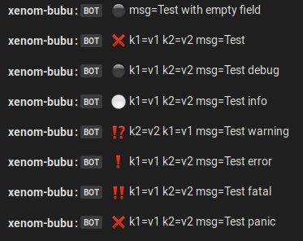

# logrus

Package logrus contains logrus's hook for Mattermost.

Features:
- Asynchronous
- No level filter: all levels from logrus will be send to Mattermost.
- Sending log as attachment (see NewHook)

Default format for log output in Mattermost:

    <username|hostname>: :icon: <field-key=field-value ...> msg=Message

* `username` is the value is passed when calling NewHook.
* `hostname` is the value of host where the application running.
* `:icon:` is the icon that will be showed as replacement of log level.
* `field-key=field-value` is the key-value when logging with fields.
* `msg=` is the message that user pass to `Debug()`, `Info()`, etc.

## Example

The following code show how to use the hook,

```
import (
	"github.com/Sirupsen/logrus"
	mmlogrus "github.com/shuLhan/mattermost-integration/hooks/logrus"
)

int main() {
	_endpoint := https://my.mattermost.org/hooks/xxx"
	_channel := "log_alpha"
	_username := "app-name"

	logrus.AddHook(mmlogrus.NewHook(_endpoint, _channel, _username, nil))

	logrus.WithFields(logrus.Fields{
		"k1": "v1",
		"k2": "v2",
	}).Info("Test info")

	mmlogrus.Stop()
}
```

NewHook will create a log hook for mattermost. The log will be send to
server at `endpoint` inside `channel` name, using `username`.

`channel` and `username` is optional.
If channel is empty then it will use the default channel defined in
incoming webhook setting.
If username is empty then it will use the hostname.

Screenshot of output:



### Log as attachment

If attachment parameter is not nil, each log will be send as attachment [1].
The parameter will act as default attachment value, and it will replace the
`Text` with `Entry.Message` and `Fields` with `Entry.Data`.

```
	...

	defAttc := Attachment{
		Pretext: "Send from test"
	}

	logrus.AddHook(mmlogrus.NewHook(_endpoint, _channel, _username,
		defAttc))

	...
```

Screenshot of output:


--

[1] https://docs.mattermost.com/developer/message-attachments.html
